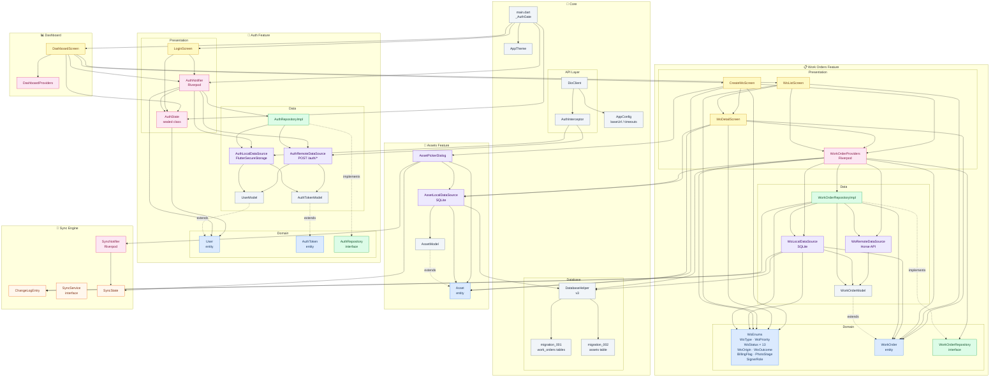

# Project Graph — Stat Trac Technical App

> Open with a Mermaid preview extension (e.g. "Markdown Preview Mermaid Support").

```mermaid
graph TB

    %% ── CORE ──────────────────────────────────────────────────────────────
    subgraph CORE["🔧 Core"]
        main["main.dart\n_AuthGate"]
        config["AppConfig\nbaseUrl / timeouts"]
        theme["AppTheme"]
        subgraph API_LAYER["API Layer"]
            dio["DioClient"]
            interceptor["AuthInterceptor"]
        end
        subgraph DB_LAYER["Database"]
            db_helper["DatabaseHelper\nv3"]
            mig1["migration_001\nwork_orders tables"]
            mig2["migration_002\nassets table"]
        end
    end

    %% ── AUTH ──────────────────────────────────────────────────────────────
    subgraph AUTH["🔐 Auth Feature"]
        subgraph AUTH_DOMAIN["Domain"]
            user_e["User\nentity"]
            token_e["AuthToken\nentity"]
            auth_repo_i["AuthRepository\ninterface"]
        end
        subgraph AUTH_DATA["Data"]
            token_model["AuthTokenModel"]
            user_model["UserModel"]
            auth_local_ds["AuthLocalDataSource\nFlutterSecureStorage"]
            auth_remote_ds["AuthRemoteDataSource\nPOST /auth/*"]
            auth_repo_impl["AuthRepositoryImpl"]
        end
        subgraph AUTH_PRES["Presentation"]
            auth_state["AuthState\nsealed class"]
            auth_providers["AuthNotifier\nRiverpod"]
            login_screen["LoginScreen"]
        end
    end

    %% ── DASHBOARD ─────────────────────────────────────────────────────────
    subgraph DASH["📊 Dashboard"]
        dash_providers["DashboardProviders"]
        dash_screen["DashboardScreen"]
    end

    %% ── WORK ORDERS ───────────────────────────────────────────────────────
    subgraph WO["📋 Work Orders Feature"]
        subgraph WO_DOMAIN["Domain"]
            wo_enums["WoEnums\nWoType · WoPriority\nWoStatus × 13\nWoOrigin · WoOutcome\nBillingFlag · PhotoStage\nSignerRole"]
            wo_e["WorkOrder\nentity"]
            wo_repo_i["WorkOrderRepository\ninterface"]
        end
        subgraph WO_DATA["Data"]
            wo_model["WorkOrderModel"]
            wo_local_ds["WoLocalDataSource\nSQLite"]
            wo_remote_ds["WoRemoteDataSource\nHorse API"]
            wo_repo_impl["WorkOrderRepositoryImpl"]
        end
        subgraph WO_PRES["Presentation"]
            wo_providers["WorkOrderProviders\nRiverpod"]
            wo_list["WoListScreen"]
            wo_detail["WoDetailScreen"]
            create_wo["CreateWoScreen"]
        end
    end

    %% ── ASSETS ────────────────────────────────────────────────────────────
    subgraph ASSETS["🏥 Assets Feature"]
        asset_e["Asset\nentity"]
        asset_model["AssetModel"]
        asset_local_ds["AssetLocalDataSource\nSQLite"]
        asset_picker["AssetPickerDialog"]
    end

    %% ── SYNC ──────────────────────────────────────────────────────────────
    subgraph SYNC["🔄 Sync Engine"]
        change_log["ChangeLogEntry"]
        sync_service["SyncService\ninterface"]
        sync_state["SyncState"]
        sync_notifier["SyncNotifier\nRiverpod"]
    end

    %% ── EDGES: CORE ───────────────────────────────────────────────────────
    main --> auth_providers
    main --> login_screen
    main --> dash_screen
    main --> auth_state
    main --> theme
    dio --> interceptor
    dio --> config
    interceptor --> auth_local_ds
    interceptor --> auth_remote_ds
    db_helper --> mig1
    db_helper --> mig2

    %% ── EDGES: AUTH ───────────────────────────────────────────────────────
    token_model -. extends .-> token_e
    user_model -. extends .-> user_e
    auth_repo_impl -. implements .-> auth_repo_i
    auth_repo_impl --> auth_local_ds
    auth_repo_impl --> auth_remote_ds
    auth_providers --> auth_repo_impl
    auth_providers --> auth_local_ds
    auth_providers --> auth_remote_ds
    auth_providers --> user_e
    auth_providers --> auth_state
    auth_state --> user_e
    login_screen --> auth_providers
    login_screen --> auth_state
    auth_local_ds --> token_model
    auth_local_ds --> user_model
    auth_remote_ds --> token_model
    auth_remote_ds --> user_model

    %% ── EDGES: DASHBOARD ──────────────────────────────────────────────────
    dash_screen --> dash_providers
    dash_screen --> auth_providers
    dash_screen --> auth_state
    dash_screen --> wo_list
    dash_screen --> create_wo

    %% ── EDGES: WORK ORDERS ────────────────────────────────────────────────
    wo_model -. extends .-> wo_e
    wo_repo_impl -. implements .-> wo_repo_i
    wo_repo_impl --> wo_local_ds
    wo_repo_impl --> wo_remote_ds
    wo_repo_impl --> wo_model
    wo_repo_impl --> change_log
    wo_repo_impl --> wo_e
    wo_repo_impl --> wo_enums
    wo_local_ds --> wo_model
    wo_local_ds --> wo_e
    wo_local_ds --> wo_enums
    wo_local_ds --> change_log
    wo_local_ds --> db_helper
    wo_remote_ds --> wo_model
    wo_providers --> wo_repo_impl
    wo_providers --> wo_local_ds
    wo_providers --> wo_remote_ds
    wo_providers --> asset_local_ds
    wo_providers --> db_helper
    wo_providers --> wo_repo_i
    wo_providers --> wo_e
    wo_providers --> wo_enums
    wo_list --> wo_providers
    wo_list --> wo_detail
    wo_list --> wo_e
    wo_list --> wo_enums
    wo_detail --> wo_providers
    wo_detail --> asset_local_ds
    wo_detail --> asset_e
    wo_detail --> wo_e
    wo_detail --> wo_enums
    create_wo --> wo_providers
    create_wo --> asset_picker
    create_wo --> asset_e
    create_wo --> wo_enums
    create_wo --> wo_detail

    %% ── EDGES: ASSETS ─────────────────────────────────────────────────────
    asset_model -. extends .-> asset_e
    asset_local_ds --> asset_model
    asset_local_ds --> asset_e
    asset_local_ds --> db_helper
    asset_picker --> asset_local_ds
    asset_picker --> asset_e
    asset_picker --> sync_notifier
    asset_picker --> sync_state

    %% ── EDGES: SYNC ───────────────────────────────────────────────────────
    sync_notifier --> sync_state

    %% ── STYLES ────────────────────────────────────────────────────────────
    classDef entity    fill:#dbeafe,stroke:#3b82f6,color:#1e3a5f
    classDef repo      fill:#dcfce7,stroke:#16a34a,color:#14532d
    classDef screen    fill:#fef9c3,stroke:#ca8a04,color:#713f12
    classDef provider  fill:#fce7f3,stroke:#db2777,color:#831843
    classDef datasrc   fill:#ede9fe,stroke:#7c3aed,color:#3b0764
    classDef sync      fill:#fff7ed,stroke:#ea580c,color:#7c2d12
    classDef core      fill:#f1f5f9,stroke:#64748b,color:#1e293b

    class user_e,token_e,wo_e,wo_enums,asset_e entity
    class auth_repo_i,auth_repo_impl,wo_repo_i,wo_repo_impl repo
    class login_screen,dash_screen,wo_list,wo_detail,create_wo screen
    class auth_providers,auth_state,wo_providers,dash_providers,sync_notifier provider
    class auth_local_ds,auth_remote_ds,wo_local_ds,wo_remote_ds,asset_local_ds,asset_picker datasrc
    class change_log,sync_service,sync_state sync
    class main,config,theme,dio,interceptor,db_helper,mig1,mig2,token_model,user_model,wo_model,asset_model core
```
